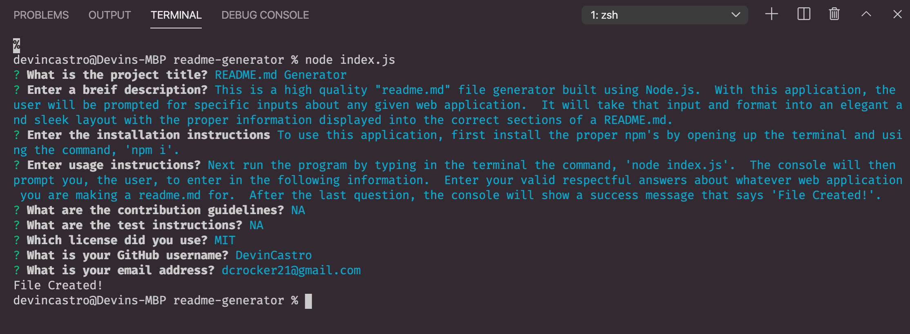
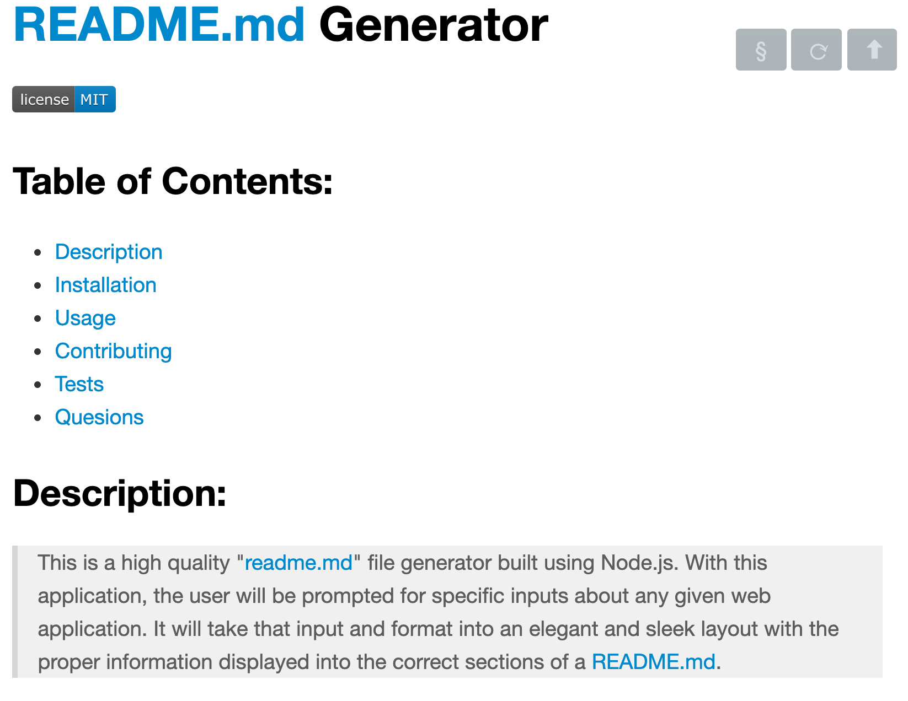
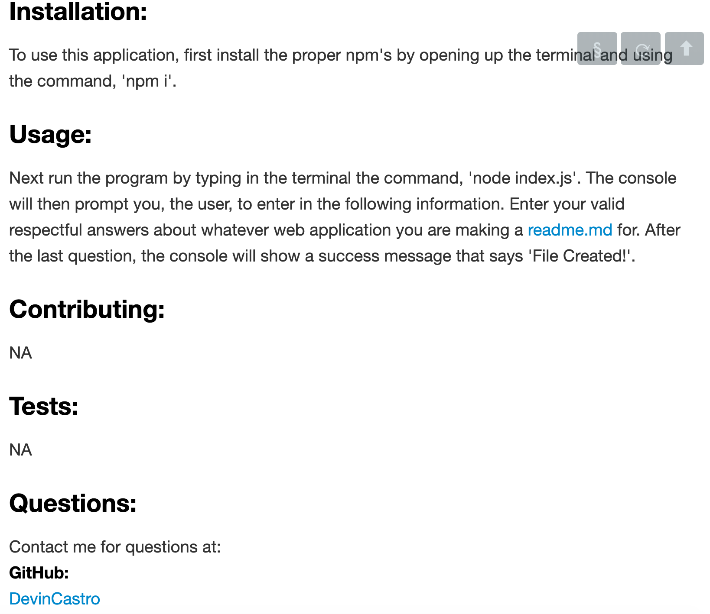
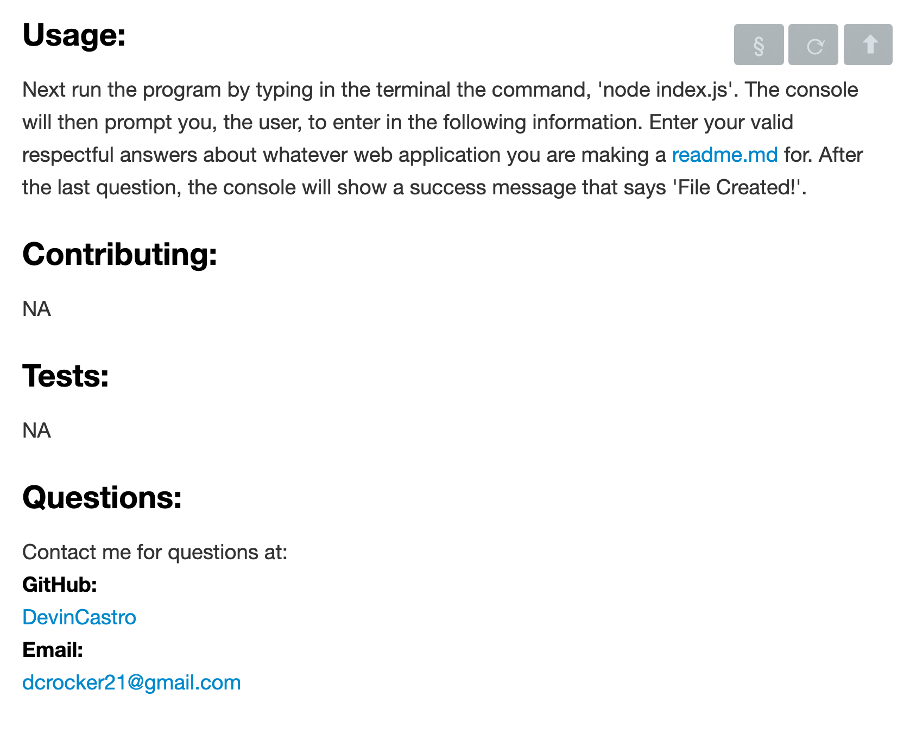

# readme-generator

Link to Video: 
Link to sample generated readme:

## Description:
>This is a high quality "readme.md" file generator built using Node.js.  With this application, the user will be prompted for specific inputs about any given web application.  It will take that input and format into an elegant and sleek layout with the proper information displayed into the correct sections of a README.md.  

### Usage: 
To use this application, first install the proper npm's by opening up the terminal and using the command, 'npm i'.  Next run the program by typing in the terminal the command, 'node index.js'.  The console will then prompt you, the user, to enter in the following information.  Enter your valid respectful answers about whatever web application you are making a readme.md for.  After the last question, the console will show a success message that says 'File Created!'.

### Example of prompts and user inputs:

### Example of newly generated README.md:

